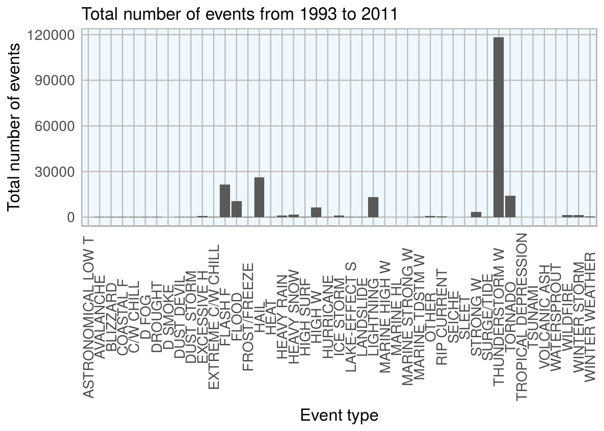
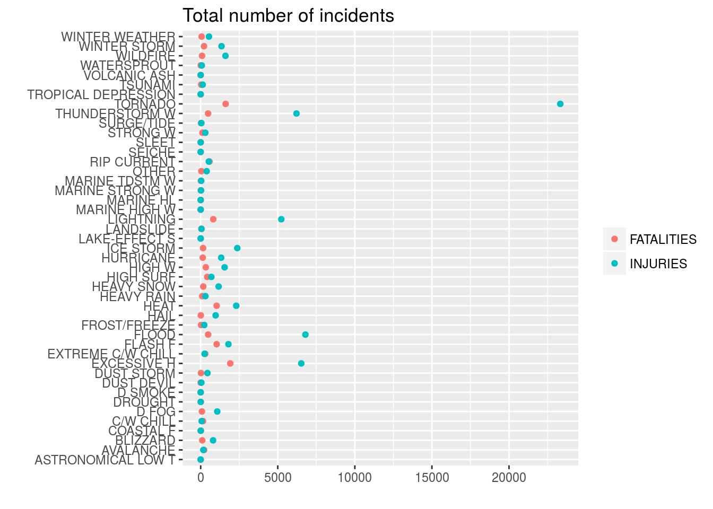
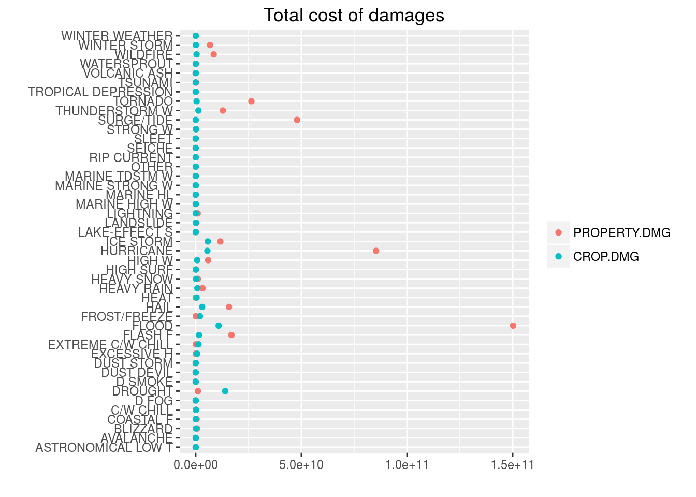

# Overview of the economic and public health problems caused by storms accross the U.S. using the National Oceanic and Atmospheric Administration's (NOAA) storm database
Vannia Gonzalez  
February 22, 2017  


## Synopsis

The objective of this assignment, a requirement for the Reproducible Research course at Coursera, is a basic exploration of the economic and public health problems caused by storms across the U.S. Many severe events can result in fatalities, injuries, and property damage, and preventing such outcomes to the extent possible is a key concern.

The following report is based on the NOAA storm database tracks characteristics of major storms and weather events in the United States, including when and where they occur, as well as estimates of any fatalities, injuries, and property damage. 

An exploratory analysis is done to show which types of events are most harmful with respect to population health and which have the greatest economic consequences. After briefly describing the storm database a data processing is thoroghly done to reduce the data set into the well known (see the NOAA documentation) types of weather events including only the most relevant years in which these were recorded and excluding events that did not cause any damage. In the last section, the results are shown.


## Storm database description

This database documents the following phenomena:

1. The occurrence of storms and other significant weather phenomena having sufficient intensity to cause loss of life, injuries, significant property damage, and/or disruption to commerce;
2. Rare, unusual, weather phenomena that generate media attention;
3. Other significant meteorological events, such as record maximum or minimum temperatures or precipitation that occur in connection with another event.  

The events in the database start in the year 1950 and end in November 2011. In the earlier years of the database there are generally fewer events recorded, most likely due to a lack of good records. More recent years should be considered more complete. 
The storm database includes $902297$ of types of events recorded. Note that several of these entries may correspond to the same event type but recorded with a different name by the storm data preparer. According to the NOAA storm database desceeiption there a total of $48$ different event types (table 2.1.1 in [StromData preparation publication](https://d396qusza40orc.cloudfront.net/repdata%2Fpeer2_doc%2Fpd01016005curr.pdf) )

The NOAA storm database used for this analysis can be downloaded from the following link [Storm data](https://d396qusza40orc.cloudfront.net/repdata%2Fdata%2FStormData.csv.bz2), from the course web site. The data set contains 37 variables. Since I am only interested in the health (fatalities or injuries) and property or crop damages across the US, we will only read the following variables: 
- BGN_DATE: When the event took place
- STATE: State abbreviation (contains territories and minor islands)
- EVTYPE: Type of weather event
- FATALITIES and INJURIES
- PROPGMG, CROPDMG: Properties and crop damages respectively.
- PROPDMGEXP, CROPDMGEXP: Exponential degree on base 10 

## Data processing

### 1. Downloading and reading the database


```r
download.file("https://d396qusza40orc.cloudfront.net/repdata%2Fdata%2FStormData.csv.bz2","repdata%2Fdata%2FStormData.csv.bz2")
```


```r
library(lubridate)
```

```
## 
## Attaching package: 'lubridate'
```

```
## The following object is masked from 'package:base':
## 
##     date
```

```r
setClass("myDate")
setAs("character","myDate", function(from) as.Date(from, format="%m/%d/%Y %H:%M:%S",origin="1950-01-01") )
data<-read.csv("repdata%2Fdata%2FStormData.csv.bz2",sep=",",header=TRUE,colClasses = c("NULL","myDate",rep("NULL",4),"factor","factor",rep("NULL",14),rep("numeric",3),"factor","numeric","factor",rep("NULL",9)))
```


### 2. Choose recorded events beginning in 1993. 

All event types were actually started to be recorded starting from 1993, this is according to the NOAA web site http://www.ncdc.noaa.gov/stormevents/details.jsp?type=collection as pointed put by F. Hong in the discussion forums of the course. For that reason in this exploratory analysis only events starting from 1993 will be compared.

To show this, let us explore data before and after 1993, comparing the number of different levels in the factor variable "EVTYPE" before and after 1993, and 1996.

Total number of different type of events in raw data set:


```r
str(data$EVTYPE)
```

```
##  Factor w/ 985 levels "?","ABNORMALLY DRY",..: 830 830 830 830 830 830 830 830 830 830 ...
```

From 1950 to 1993


```r
df5093<-data[data$BGN_DATE<="1993-01-01" & data$BGN_DATE>="1950-01-01","EVTYPE"]
df5093<-factor(df5093)
str(df5093)
```

```
##  Factor w/ 11 levels "AVALANCHE","FLOOD",..: 10 10 10 10 10 10 10 10 10 10 ...
```

From 1993 to 1996


```r
df9396<-data[data$BGN_DATE<="1996-01-01" & data$BGN_DATE>="1993-01-01","EVTYPE"]
df9396<-factor(df9396)
str(df9396)
```

```
##  Factor w/ 601 levels "?","AGRICULTURAL FREEZE",..: 116 395 291 413 595 413 280 140 470 470 ...
```

Therefore, I will include those events starting from 1993. Note that there are still much more than 48 event types, which is the number reported in the StormData publication. Many of these were recorded with similar names, or misspelled, so the data has to be cleaned before exploring it. 

- Select data starting at 1993


```r
df<-data[data$BGN_DATE>="1993-01-01",]
```

### 3. Check for NA or NULL values


```r
vars<-names(df)
checknanull<-sapply(vars[4:9],function(x){c(sum(is.na(df[x])),sum(is.null(df[x])))})
```

### 4. Manipulating exponential variables. 

Several analysis have been done by [David Hood and others](https://rstudio-pubs-static.s3.amazonaws.com/58957_37b6723ee52b455990e149edde45e5b6.html) on the interpretation of exponential values different from $M,m=E6$, $B,b=E9$, $K,k=E3$ or $H,h=E2$.  Most of the numeric values in the EXP variables can be interpreted as $numeric:{1,9} =E1$, $? = NA$, $- = NA$, $+= E0$.
Let us look at the frequency of these levels


```r
table(df$PROPDMGEXP)
```

```
## 
##             -      ?      +      0      1      2      3      4      5 
## 313139      1      8      5    216     25     13      4      4     28 
##      6      7      8      B      h      H      K      m      M 
##      4      5      1     40      1      6 392674      7   8557
```

```r
table(df$CROPDMGEXP)
```

```
## 
##             ?      0      2      B      k      K      m      M 
## 430854      7     19      1      9     21 281832      1   1994
```

We can see that when compared to PROPDMEXP= E9,E6 or CROPDMEXP =E9,E6, all the numeric values, and the "?,+,-" which are within $[E0,E1]$, are not significant. Therefore we can ignore them. The null values are all equal to NA on total damages cost, so we will exclude them too.


```r
expsubsetprop<-grep("\\?|\\+|-|^\\s*$|[0-9]",df$PROPDMGEXP)
expsubsetcrop<-grep("\\?|\\+|-|^\\s*$|[0-9]",df$CROPDMGEXP)
df$PROPDMG[expsubsetprop]<-0 #replace all the corresponding PROPDMG or CROPDMG with 0 
df$CROPDMG[expsubsetcrop]<-0
df$PROPDMGEXP[expsubsetprop]<-0 #replace all the corresponding PROPDMG or CROPDMG with 0 
df$CROPDMGEXP[expsubsetcrop]<-0
df$PROPDMGEXP<-toupper(df$PROPDMGEXP)
df$CROPDMGEXP<-toupper(df$CROPDMGEXP)
```

### 5. Excluding those that did not cause any damage

I will exclude all those events that did not cause any damage, sicne we are interested in exploring only the damages caused.


```r
dfdam<-df[df$FATALITIES!=0 | df$INJURIES!=0 | df$PROPDMG!=0 | df$CROPDMG!=0,]
```

- Now mutliply the variables PROPDMG and CROPDMG with the exponential variables (in exponent form).


```r
library(plyr)
```

```
## 
## Attaching package: 'plyr'
```

```
## The following object is masked from 'package:lubridate':
## 
##     here
```

```r
dfdam$PROPDMGEXP<-revalue(dfdam$PROPDMGEXP, c("B"="E9", "M"="E6","K"="E3","H"="E2")) # or levels(dfdam$PROPDMGEXP)<-c("E9","E2","E3","E6")
dfdam$CROPDMGEXP<-revalue(dfdam$CROPDMGEXP, c("B"="E9", "M"="E6","K"="E3"))
dfdam$PROPDMG <- do.call(paste, c(dfdam[c("PROPDMG","PROPDMGEXP")], sep=""))
dfdam$CROPDMG <- do.call(paste, c(dfdam[c("CROPDMG","CROPDMGEXP")], sep=""))
dfdam$PROPDMG<-as.numeric(dfdam$PROPDMG)
dfdam$CROPDMG<-as.numeric(dfdam$CROPDMG)
dfdam<-dfdam[-c(7,9)]
```

### 6. Matching and minimizing the number of event types

Here I will try to match all the event types (around 900) with those 48 event types reported from the NOAA publication.

- Change to upper case


```r
dfdam$EVTYPE<-toupper(dfdam$EVTYPE)
length(unique(dfdam$EVTYPE))
```

```
## [1] 443
```

I included a reference list for event types (from table 2.1.1 from the National Weather Service Storm Data Documentation) in file "/files/evtyperef.csv". 


```r
EVTYPEREF<-read.csv("files/evtyperef.csv",header=TRUE,colClasses = "character");EVTYPEREF<-toupper(EVTYPEREF$EVTYPEREF)
```

- Let us take a first look on approximate matches with the reference list above from all the evtype values


```r
uniquematches<-lapply(EVTYPEREF,function(x){unique(grep(x,dfdam$EVTYPE,value = TRUE))})
```

- The way I will match several events that share identical words, or share multiple events in one entry is by identifying first by most severe, for example if an event is described as "heavry rain/flood/hurricane", then "hurricane is chosen", that is "hurricane" is matched first, then "flood" and then "rain". For this reason I have to choose for each match a selected order, such as:


```r
dfdam$EVTYPE[grep("ASTRONOMICAL LOW TIDE|LOW TIDE",dfdam$EVTYPE)]<-"ASTRONOMICAL LOW T"
dfdam$EVTYPE[grep("HIGH WATER|SEAS|HIGH TIDE|SURF|SWELL|WAVE|RISING",dfdam$EVTYPE)]<-"HIGH SURF"
dfdam$EVTYPE[grep("(?<!LOW )(?<! HIGH)TIDE",dfdam$EVTYPE,perl=TRUE)]<-"SURGE/TIDE"
dfdam$EVTYPE[grep("(?<!COASTAL )SURGE",dfdam$EVTYPE,perl=TRUE)]<-"SURGE/TIDE"
dfdam$EVTYPE[grep("MARINE THUNDERSTORM WIND|MARINE TSTM WIND",dfdam$EVTYPE)]<-"MARINE TDSTM W"
dfdam$EVTYPE[grep("(?<!DUST )(?<!WINTER )(?<!ICE )(?<!TROPICAL )STORM",dfdam$EVTYPE,perl=TRUE)]<-"THUNDERSTORM W"
dfdam$EVTYPE[grep("(?<!MARINE )TDSTM|(?<!MARINE )TSTM|MICROB|DOWNB",dfdam$EVTYPE,perl = TRUE)]<-"THUNDERSTORM W"
dfdam$EVTYPE[agrep("ICE STORM",dfdam$EVTYPE,max.distance = 2)]<-"I STORM"
dfdam$EVTYPE[grep("WINTER STORM",dfdam$EVTYPE)]<-"WINTER STORM"
dfdam$EVTYPE[grep("TROPICAL STORM",dfdam$EVTYPE)]<-"TROPICAL STORM"
dfdam$EVTYPE[grep("DUST STORM|BLOWING DUST",dfdam$EVTYPE)]<-"DUST STORM"
dfdam$EVTYPE[grep("FLASH",dfdam$EVTYPE)]<-"FLASH F"
dfdam$EVTYPE[grep("(?<!COASTAL )(?<!ICE )FLOOD",dfdam$EVTYPE,perl = TRUE)]<-"FLOOD"
dfdam$EVTYPE[grep("COASTAL",dfdam$EVTYPE)]<-"COASTAL F"
dfdam$EVTYPE[agrep("LIGHTNING",dfdam$EVTYPE,max.distance = 2)]<-"LIGHTNING"
dfdam$EVTYPE[grep("WINTER WEATHER",dfdam$EVTYPE)]<-"WINTER WEATHER"
dfdam$EVTYPE[grep("TROPICAL DEPRESSION",dfdam$EVTYPE)]<-"TROPICAL DEPRESSION"
dfdam$EVTYPE[agrep("WATERSPROUT",dfdam$EVTYPE,max.distance = 2)]<-"WATERSPROUT"
dfdam$EVTYPE[agrep("TORNADO",dfdam$EVTYPE,max.distance = 2)]<-"TORNADO"
dfdam$EVTYPE[grep("MARINE STRONG WIND",dfdam$EVTYPE)]<-"MARINE STRONG W"
dfdam$EVTYPE[agrep("RIP CURRENT",dfdam$EVTYPE,max.distance = 2)]<-"RIP CURRENT"
dfdam$EVTYPE[agrep("SLEET",dfdam$EVTYPE,max.distance = 2)]<-"SLEET"
dfdam$EVTYPE[agrep("AVALANCHE",dfdam$EVTYPE,max.distance = 2)]<-"AVALANCHE"
dfdam$EVTYPE[agrep("BLIZZARD",dfdam$EVTYPE,max.distance = 2)]<-"BLIZZARD"
dfdam$EVTYPE[grep("LAKE-EFFECT SNOW",dfdam$EVTYPE)]<-"LAKE-EFFECT S"
dfdam$EVTYPE[grep("SNOW",dfdam$EVTYPE)]<-"HEAVY SNOW"
dfdam$EVTYPE[grep("HURRICANE|TYPHOON",dfdam$EVTYPE)]<-"HURRICANE"
dfdam$EVTYPE[agrep("WILDFIRE",dfdam$EVTYPE,max.distance = 2)]<-"WILDFIRE"
dfdam$EVTYPE[agrep("DUST DEVIL",dfdam$EVTYPE,max.distance = 2)]<-"DUST DEVIL"
dfdam$EVTYPE[agrep("WILDFIRE",dfdam$EVTYPE,max.distance = 2)]<-"WILDFIRE"
dfdam$EVTYPE[agrep("DROUGHT",dfdam$EVTYPE,max.distance = 2)]<-"DROUGHT"
dfdam$EVTYPE[agrep("EXCESSIVE HEAT",dfdam$EVTYPE,max.distance = 2)]<-"EXCESSIVE H"
dfdam$EVTYPE[grep("HEAT|WARM",dfdam$EVTYPE)]<-"HEAT"
dfdam$EVTYPE[grep("MARINE HAIL",dfdam$EVTYPE)]<-"MARINE HL"
dfdam$EVTYPE[grep("MARINE HIGH WIND",dfdam$EVTYPE)]<-"MARINE HIGH W"
dfdam$EVTYPE[grep("HAIL",dfdam$EVTYPE)]<-"HAIL"
dfdam$EVTYPE[grep("STRONG WIND",dfdam$EVTYPE)]<-"STRONG W"
dfdam$EVTYPE[grep("EXTREME COLD|HYPOTHERMIA|HYPERTHERMIA",dfdam$EVTYPE)]<-"EXTREME C/W CHILL"
dfdam$EVTYPE[grep("COLD|LOW TEMPERATURE|COOL",dfdam$EVTYPE)]<-"C/W CHILL"
dfdam$EVTYPE[grep("FREEZING FOG",dfdam$EVTYPE)]<-"F FOG"
dfdam$EVTYPE[grep("(?<!FREEZING )FOG",dfdam$EVTYPE,perl = TRUE)]<-"D FOG"
dfdam$EVTYPE[grep("DENSE SMOKE|SMOKE",dfdam$EVTYPE)]<-"D SMOKE"
dfdam$EVTYPE[grep("ICE|FROST|FREEZ|ICY",dfdam$EVTYPE)]<-"FROST/FREEZE"
dfdam$EVTYPE[grep("RAIN|PRECIP|SHOWER",dfdam$EVTYPE)]<-"HEAVY RAIN"
dfdam$EVTYPE[grep("WIND",dfdam$EVTYPE)]<-"HIGH W"
dfdam$EVTYPE[grep("SLIDE|SLUMP|SPOUT",dfdam$EVTYPE)]<-"LANDSLIDE"
dfdam$EVTYPE[grep("I STORM",dfdam$EVTYPE)]<-"ICE STORM"
dfdam$EVTYPE[grep("FIRE",dfdam$EVTYPE)]<-"WILDFIRE"
dfdam$EVTYPE[grep("\\?|APACHE|BEACH|DAM|DENSE|FUNNEL|GLAZE|MIX|TURBULENCE|URBAN|ACCIDENT|DROWNING|MISHAP|HIGH$",dfdam$EVTYPE)]<-"OTHER"
```

Let us look at the resulting event types:


```r
events<-unique(dfdam[order(dfdam$EVTYPE),"EVTYPE"])
length(events)
```

```
## [1] 45
```

```r
events
```

```
##  [1] "ASTRONOMICAL LOW T"  "AVALANCHE"           "BLIZZARD"           
##  [4] "COASTAL F"           "C/W CHILL"           "D FOG"              
##  [7] "DROUGHT"             "D SMOKE"             "DUST DEVIL"         
## [10] "DUST STORM"          "EXCESSIVE H"         "EXTREME C/W CHILL"  
## [13] "FLASH F"             "FLOOD"               "FROST/FREEZE"       
## [16] "HAIL"                "HEAT"                "HEAVY RAIN"         
## [19] "HEAVY SNOW"          "HIGH SURF"           "HIGH W"             
## [22] "HURRICANE"           "ICE STORM"           "LAKE-EFFECT S"      
## [25] "LANDSLIDE"           "LIGHTNING"           "MARINE HIGH W"      
## [28] "MARINE HL"           "MARINE STRONG W"     "MARINE TDSTM W"     
## [31] "OTHER"               "RIP CURRENT"         "SEICHE"             
## [34] "SLEET"               "STRONG W"            "SURGE/TIDE"         
## [37] "THUNDERSTORM W"      "TORNADO"             "TROPICAL DEPRESSION"
## [40] "TSUNAMI"             "VOLCANIC ASH"        "WATERSPROUT"        
## [43] "WILDFIRE"            "WINTER STORM"        "WINTER WEATHER"
```

## Results

As stated before, I am interested in which types of events are most harmful with respect to population health across the U.S., and which types of events have the greatest economic consequences across the U.S. 

First, let us look at the most frequent events through out the years, which not need to be necessarily the most harmful. The figure below shows the total number of events from 1993 to 2011 for each type of weather event.


```r
library(ggplot2)
g1<-ggplot(dfdam,aes(dfdam$EVTYPE))
g1+geom_bar()+ theme(axis.text.x = element_text(angle = 90, hjust = 1))+labs(title="Total number of events from 1993 to 2011",x="Event type",y="Total number of events")
```



### 1. Consequences in population health 

The most harmful events need not to be the most frequent. In order to explore which type of event has been most harmful through out the years, let us look at the total number of fatalities and injuries for each weather event type, as shown in the chart below.


```r
library(reshape2)
fatevents<-setNames(aggregate(dfdam$FATALITIES~dfdam$EVTYPE,FUN = sum),c("Type","Fatalities"))
injevents<-setNames(aggregate(dfdam$INJURIES~dfdam$EVTYPE,FUN = sum),c("Type","Injuries"))
fatinjevents<-setNames(data.frame(fatevents$Type,fatevents$Fatalities,injevents$Injuries),c("Type","FATALITIES","INJURIES"))
df_melted <- melt(fatinjevents, id=c("Type"))
g2<-ggplot(df_melted,aes(x=value,y=Type,color=variable))+geom_point()
g2+labs(title="Total number of incidents",x="",y="")+theme(legend.title=element_blank())
```



From the figure above we can see that the event that has caused most harm through out the years is the Tornado. However, this may not be the type of event that has caused most harm in a single day (or event period). This is illustrated in the following tables, were I show the top 10 most harmful incidents, where the first row shows the maximum number of fatalities and injuries in each tables, respectively.


```r
library(knitr)
dftop<-dfdam[with(dfdam,order(-dfdam$FATALITIES,-dfdam$INJURIES)),]
kable(head(dftop,10))
```

         BGN_DATE     STATE   EVTYPE         FATALITIES   INJURIES   PROPDMG     CROPDMG
-------  -----------  ------  ------------  -----------  ---------  --------  ----------
198704   1995-07-12   IL      HEAT                  583          0   0.0e+00           0
862634   2011-05-22   MO      TORNADO               158       1150   2.8e+09           0
355128   1999-07-28   IL      EXCESSIVE H            99          0   0.0e+00           0
371112   1999-07-04   PA      EXCESSIVE H            74        135   0.0e+00           0
230927   1995-07-01   PA      EXCESSIVE H            67          0   0.0e+00           0
247938   1995-07-13   WI      HEAT                   57          0   0.0e+00           0
598500   2005-09-21   TX      EXCESSIVE H            49          0   0.0e+00           0
606363   2006-07-16   CA      EXCESSIVE H            46         18   1.7e+05   492400000
860386   2011-04-27   AL      TORNADO                44        800   1.5e+09           0
362850   1999-07-18   MO      EXCESSIVE H            42        397   0.0e+00           0

```r
dftop2<-dfdam[with(dfdam,order(-dfdam$INJURIES,-dfdam$FATALITIES)),]
kable(head(dftop2,10))
```

         BGN_DATE     STATE   EVTYPE         FATALITIES   INJURIES    PROPDMG    CROPDMG
-------  -----------  ------  ------------  -----------  ---------  ---------  ---------
223449   1994-02-08   OH      ICE STORM               1       1568   5.00e+07   5.00e+06
862634   2011-05-22   MO      TORNADO               158       1150   2.80e+09   0.00e+00
860386   2011-04-27   AL      TORNADO                44        800   1.50e+09   0.00e+00
344159   1998-10-17   TX      FLOOD                   2        800   5.00e+07   5.00e+04
529351   2004-08-13   FL      HURRICANE               7        780   5.42e+09   2.85e+08
344178   1998-10-17   TX      FLOOD                   0        750   2.68e+08   1.55e+06
858228   2011-04-27   AL      TORNADO                20        700   7.00e+08   0.00e+00
344158   1998-10-17   TX      FLOOD                  11        600   8.00e+06   1.00e+05
344163   1998-10-17   TX      FLOOD                   0        550   6.60e+07   2.30e+05
667233   2007-08-04   MO      EXCESSIVE H             2        519   0.00e+00   0.00e+00


### 2. Consequences in economy 

The figure below shows the total amount in damages each of the weather events has caused through out 1993 to 2011 and across the U.S. It is clear that 'Floods' have caused the most. Inflation parameters were not considered in this report. 


```r
prop<-setNames(aggregate(dfdam$PROPDMG~dfdam$EVTYPE,FUN = sum),c("Type","PROPERTY.DMG"))
crop<-setNames(aggregate(dfdam$CROPDMG~dfdam$EVTYPE,FUN = sum),c("Type","CROP.DMG"))
propcrop<-setNames(data.frame(prop$Type,prop$PROPERTY.DMG,crop$CROP.DMG),c("Type","PROPERTY.DMG","CROP.DMG"))
df_melted <- melt(propcrop, id=c("Type"))
g2<-ggplot(df_melted,aes(x=value,y=Type,color=variable))+geom_point()
g2+labs(title="Total cost of damages",x="",y="")+theme(legend.title=element_blank())
```



The following tables show the top 10 most damaging events in properties and crops cost, where the first row shows the most damaging for properties and crops, respectively.


```r
library(knitr)
dftop3<-dfdam[with(dfdam,order(-dfdam$PROPDMG,-dfdam$CROPDMG)),]
kable(head(dftop3,10))
```

         BGN_DATE     STATE   EVTYPE        FATALITIES   INJURIES     PROPDMG    CROPDMG
-------  -----------  ------  -----------  -----------  ---------  ----------  ---------
605953   2006-01-01   CA      FLOOD                  0          0   1.150e+11   3.25e+07
577676   2005-08-29   LA      SURGE/TIDE             0          0   3.130e+10   0.00e+00
577675   2005-08-28   LA      HURRICANE              0          0   1.693e+10   0.00e+00
581535   2005-08-29   MS      SURGE/TIDE             0          0   1.126e+10   0.00e+00
569308   2005-10-24   FL      HURRICANE              5          0   1.000e+10   0.00e+00
581533   2005-08-28   MS      HURRICANE              0          0   7.350e+09   0.00e+00
581537   2005-08-29   MS      HURRICANE             15        104   5.880e+09   1.51e+09
529351   2004-08-13   FL      HURRICANE              7        780   5.420e+09   2.85e+08
443782   2001-06-05   TX      ICE STORM             22          0   5.150e+09   0.00e+00
198389   1993-08-31   IL      FLOOD                  0          0   5.000e+09   5.00e+09

```r
dftop4<-dfdam[with(dfdam,order(-dfdam$CROPDMG,-dfdam$PROPDMG)),]
kable(head(dftop4,10))
```

         BGN_DATE     STATE   EVTYPE               FATALITIES   INJURIES    PROPDMG      CROPDMG
-------  -----------  ------  ------------------  -----------  ---------  ---------  -----------
198389   1993-08-31   IL      FLOOD                         0          0   5.00e+09   5000000000
211900   1994-02-09   MS      ICE STORM                     0          0   5.00e+05   5000000000
581537   2005-08-29   MS      HURRICANE                    15        104   5.88e+09   1510000000
639347   2006-01-01   TX      DROUGHT                       0          0   0.00e+00   1000000000
312986   1998-12-20   CA      EXTREME C/W CHILL             0          0   0.00e+00    596000000
422676   2001-08-01   IA      DROUGHT                       0          0   0.00e+00    578850000
410175   2000-11-01   TX      DROUGHT                       0          0   0.00e+00    515000000
366694   1999-09-15   NC      HURRICANE                     0          0   3.00e+09    500000000
384125   2000-10-03   FL      FLOOD                         0          0   4.50e+08    500000000
667177   2007-07-01   MO      FLOOD                         0          0   5.00e+03    500000000

### 3. Most affected state

The following result shows which state was the most affected (with most frequent events) in the period from 1993 to 2011.


```
## 
## Attaching package: 'dplyr'
```

```
## The following objects are masked from 'package:plyr':
## 
##     arrange, count, desc, failwith, id, mutate, rename, summarise,
##     summarize
```

```
## The following objects are masked from 'package:lubridate':
## 
##     intersect, setdiff, union
```

```
## The following objects are masked from 'package:stats':
## 
##     filter, lag
```

```
## The following objects are masked from 'package:base':
## 
##     intersect, setdiff, setequal, union
```


```r
statemax<-dfdam%>%group_by(STATE)%>%summarise(freq=n())
statemax[statemax$freq==max(statemax$freq),"STATE"]
```

```
## # A tibble: 1 × 1
##    STATE
##   <fctr>
## 1     TX
```

